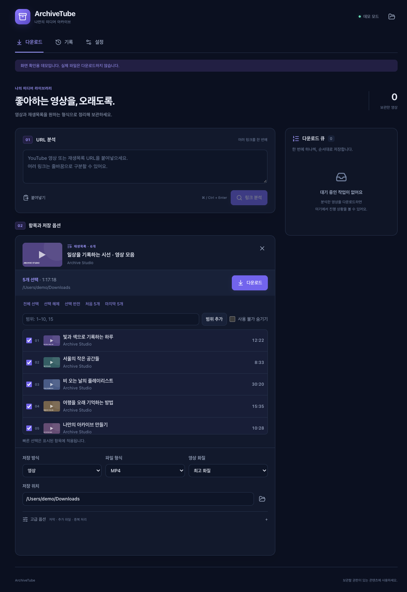
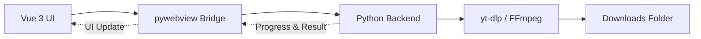

<div align="center">
  
  <h1>ArchiveTube</h1>
  <p>YouTube 영상과 재생목록을 MP4·WebM·MP3·M4A로 정리하고 대기열과 기록으로 관리하는 데스크톱 애플리케이션</p>

  <p>
    
    
    
    
    
  </p>
</div>



## 주요 기능

- 다운로드·기록·설정 탭, 한국어 UI, 다크·라이트·시스템 테마와 모션 감소
- 여러 URL 분석과 순차 대기열: 순서 변경, 다음 작업 일시정지, 취소, 실패 항목 재시도
- MP4 / WebM 최고·1080p 이하·720p 이하, MP3 320/192/128kbps, M4A 원본 품질
- 재생목록 검색·범위 입력·선택 반전·처음/마지막 5개·사용 불가 숨기기
- 혼합 URL에서 재생목록 또는 현재 영상 선택, 원래 순번과 영상 ID 보존
- 기본/작업별 저장 폴더, 충돌 시 건너뛰기·덮어쓰기·번호 접미사 이름 변경
- 자막 별도 저장/영상 트랙 삽입, 자동 생성 자막, 썸네일·설명·메타데이터 보관
- 선택적 브라우저 로그인 세션, 클립보드 URL 제안, 큐 종료 시스템 알림
- SQLite 설정·작업·기록 보존, 재시작 후 명시적 재개, 최종 파일과 오류 상세 확인

기본값은 다크 테마, MP4 최고 화질 / MP3 192kbps, 이름 변경입니다. 자막·추가 보관·쿠키·클립보드 감지·알림은 모두 기본 비활성화입니다.

## 사용 흐름과 복원

URL을 줄바꿈으로 입력하고 분석한 뒤 카드별 항목과 옵션을 선택합니다. 실행 중에도 다른 URL을 분석하고 대기열에 추가할 수 있습니다. **일시정지**는 현재 작업을 끝낸 뒤 다음 작업 시작을 멈춥니다. **취소**는 수신을 중단하며, 이미 변환 중이면 해당 변환이 끝난 뒤 멈춥니다.

재생목록은 8개씩 페이지로 표시하며 페이지를 바꿔도 선택을 유지합니다. 전체 선택·반전·처음/마지막 5개는 현재 검색·필터 결과 전체에 적용됩니다. 대기열과 결과 목록의 중첩 스크롤을 없애고, 본문·입력은 14~15px, 보조 설명은 최소 13px로 정리했습니다.

앱을 다시 열면 미완료 큐가 복원되지만 자동 실행하지 않습니다. **재개**를 눌러 계속하세요. 재시도는 완료·건너뜀 항목을 제외한 새 작업이며 원래 기록을 유지합니다. 기록 삭제는 다운로드 파일을 지우지 않습니다.

설정과 기록은 `platformdirs`가 결정하는 사용자 앱 데이터 폴더의 `archive.db`에 저장됩니다. macOS는 `~/Library/Application Support/ArchiveTube`, Windows는 일반적으로 `%LOCALAPPDATA%\ArchiveTube`입니다. 개발 검증 시 `ARCHIVETUBE_DATABASE`로 별도 DB 경로를 지정할 수 있습니다. 쿠키 값은 DB에 저장하지 않습니다.

## 애플리케이션 구조



## 기술 스택

| 영역 | 기술 |
| --- | --- |
| Frontend | Vue 3, Vite, SCSS, Lucide Icons |
| Desktop | Python 3, pywebview |
| Media | yt-dlp, imageio-ffmpeg, FFmpeg |
| Packaging | PyInstaller, Pillow |
| Test | Python unittest, yt-dlp mocking |

## 저장 규칙

기본 저장 위치는 운영체제의 다운로드 폴더이며 설정 또는 작업별로 변경할 수 있습니다. 품질 상한 내에서 실제 제공되는 최고 품질을 사용합니다. 결과 상세에서 실제 화질과 최종 경로를 확인할 수 있습니다.

```text
# 단일 영상
Downloads/영상 제목.mp4
Downloads/영상 제목.mp3

# 재생목록
Downloads/재생목록 제목/01 - 영상 제목.mp4
Downloads/재생목록 제목/02 - 영상 제목.mp4
```

## 프로젝트 구조

```text
ArchiveTube/
├── backend/                # Python 백엔드와 테스트
│   ├── main.py
│   └── tests/
├── frontend/               # Vue 3 사용자 인터페이스
│   ├── public/
│   └── src/
├── deploy/                 # 앱 빌드 스크립트와 패키징 문서
└── README.md
```

## 개발 환경 실행

### 요구 사항

- Python 3.10 이상
- Node.js 22.12 이상 (YouTube 챌린지 런타임 포함)
- npm
- FFmpeg와 FFprobe (`PATH`에 설치, macOS: `brew install ffmpeg`)

### 1. Python 환경 준비

```bash
cd backend
python -m venv venv
```

macOS 또는 Linux:

```bash
source venv/bin/activate
pip install -r requirements.txt
```

Windows:

```powershell
venv\Scripts\activate
pip install -r requirements.txt
```

### 2. 개발 서버 실행

터미널 1 — Vue 개발 서버:

```bash
cd frontend
npm install
npm run dev
```

터미널 2 — 데스크톱 앱:

```bash
# macOS / Linux
backend/venv/bin/python backend/main.py

# Windows
backend/venv/Scripts/python.exe backend/main.py
```

## 테스트

```bash
# 백엔드 단위 테스트
backend/venv/bin/python -m unittest discover -s backend/tests -v

# 프런트엔드 프로덕션 빌드 검증
cd frontend
npm test
npm run build
```

프로젝트 루트에서 `backend/venv/bin/python backend/tests/smoke_desktop.py`를 실행하면 임시 DB와 모의 미디어로 실제 macOS WebView의 분석→선택→큐→기록→설정 저장을 확인합니다. 실제 YouTube 다운로드는 하지 않습니다. 검증 범위와 남은 실기 확인은 [검증 기록](docs/VERIFICATION.md)을 참고하세요.

브라우저만 열면 Python 연결 안내가 표시됩니다. 명시적 개발 미리보기는 Vite의 `http://localhost:5173/?demo=1`이며 모의 데이터만 사용합니다. 이 데모는 프로덕션 빌드에 포함되지 않습니다.

## 데스크톱 앱 빌드

빌드 도구를 설치한 다음 프로젝트 루트에서 패키징 스크립트를 실행합니다.

```bash
backend/venv/bin/python -m pip install pyinstaller Pillow
backend/venv/bin/python deploy/build.py
```

| 운영체제 | 결과물 |
| --- | --- |
| macOS | `dist/ArchiveTube.app` |
| Windows | `dist/ArchiveTube.exe` |

macOS용 DMG 생성 방법은 [macOS 패키징 가이드](deploy/macOS_Packaging.md)를 참고하세요.

## 제한 사항 및 사용 안내

- YouTube의 API 및 정책 변경에 따라 다운로드가 일시적으로 실패할 수 있습니다.
- 호환성을 유지하려면 `yt-dlp`를 최신 버전으로 업데이트해야 합니다.
- 로그인 세션은 설정에서 브라우저와 선택적 프로필 경로를 지정합니다. 브라우저 잠금·키체인 권한·암호화 방식 때문에 쿠키 읽기가 실패할 수 있습니다. 브라우저를 닫고 권한을 확인한 뒤 재시도하세요.
- 자막이 없거나 처리에 실패해도 미디어 결과와 분리해 경고로 표시합니다. 오디오는 자막 별도 저장만 지원합니다.
- macOS 시스템 알림은 서명된 `.app`에서 사용합니다. 개발용 Python 실행에서는 알림 활성화를 안내 오류로 처리합니다. OS 알림 허용과 집중 모드에 따라 표시 여부가 달라집니다.
- ArchiveTube는 YouTube 또는 Google이 제작·승인·후원한 제품이 아닙니다.
- 본인이 다운로드 및 보관할 권한이 있는 콘텐츠에만 사용하고 YouTube 이용약관과 관련 법률을 준수하세요.
